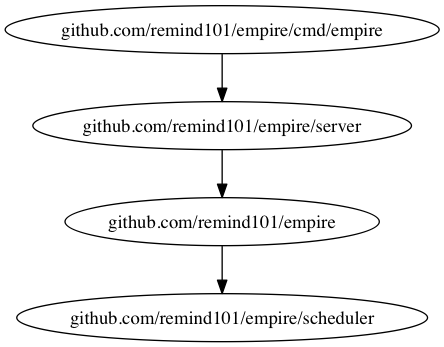

# Contributing to Empire

## Topics

* [Reporting Issues](#reporting-issues)
* [Submitting Pull Requests](#submitting-pull-requests)

## Reporting Issues

A great way to contribute to the project is to send a detailed report when you encounter an issue. We always appreciate a well-written, thorough bug report, and will thank you for it!
Check that [our issue database](https://github.com/remind101/empire/issues) doesn't already include that problem or suggestion before submitting an issue. If you find a match, add a quick "+1" or "I have this problem too." Doing this helps prioritize the most common problems and requests.

Please also include the steps required to reproduce the problem if possible and applicable. This information will help us review and fix your issue faster.

## Submitting Pull Requests

We want the development of Empire to be driven by the needs of the community, so pull requests are highly encouraged. We do have some guidelines that we would like people to follow:

* If your change is non-trivial, or implements a new feature, please create an issue first so the community and maintainers can discuss the change before implementation happens.

When submitting a pull request, here are some things to keep in mind:

* Is your change backwards compatible? Would this require any migration steps? Will any changes be required in the [CLI](https://github.com/remind101/empire/tree/master/cmd/emp)?
* Does your change require changes to the documentation? Does the quickstart guide need to be updated?
* Did you add appropriate test coverage? Submissions that add features or change core functionality will not be accepted without sufficient tests. We favor stability over anything else.
* Did you update the CHANGELOG?

## Code Structure

Empire is a fairly large codebase, separated into packages that depend on each other. In a nutshell, the most important packages are:

* **[github.com/remind101/empire](./)**: This is the "core" internal API of Empire, which "control" layers (like the REST API) consume.
* **[github.com/remind101/empire/server](./server)**: This contains an [http.Handler](https://golang.org/pkg/net/http/#Handler) implementation for serving the Empire API, which is what the `emp` CLI communicates with.
* **[github.com/remind101/empire/scheduler](./scheduler)**: This is the layer that the core of Empire interacts with for submitting releases to be scheduled on a cluster of machines. The canonical implementation uses CloudFormation + ECS to run applications.
* **[github.com/remind101/empire/cmd](./cmd)**: Holds both the [empire](./cmd/empire) (daemon) command and [emp](./cmd/emp) (client) command.

The dependency graph for the packages above, and how they interact with each other looks like this:



## Tests

Unit tests live alongside each go file as `_test.go`.

There is also a `tests` directory that contains integration and functional tests that tests the system using the [heroku-go][heroku-go] client and the [emp][emp] command.

The easiest way to run the tests is by using [docker-compose](https://docs.docker.com/compose/).

### Docker Compose

To get started, run:

```console
$ docker-compose -f docker-compose.test.yml build
$ docker-compose -f docker-compose.test.yml up -d db
```

Then run the tests with:

```console
$ docker-compose -f docker-compose.test.yml run tests
```

### Mac

To get started, run:

```console
$ make bootstrap
```

The bootstrap command assumes you have a running postgres server. It will create a database called `empire`
using the postgres client connection defaults.

To run the tests:

```console
$ make test
```

**NOTE**: You may need to install libxmlsec1 for the tests to run. You can do this with:

```console
$ brew install libxmlsec1 libxml2 pkg-config
```

## Development

If you want to contribute to Empire, you may end up wanting to run a local instance against an ECS cluster. Doing this is relatively easy:

1. Ensure that you have the AWS CLI installed and configured.
2. Ensure that you accepted the terms and conditions for the official ECS AMI:

   https://aws.amazon.com/marketplace/fulfillment?productId=52d5fd7f-92c7-4d60-a830-41a596f4d8f3&region=us-east-1

   Also check that the offical ECS AMI ID for US East matches with the one in [cloudformation.json](./docs/cloudformation.json): https://github.com/remind101/empire/blob/master/docs/cloudformation.json#L20

3. Run docker-machine and export the environment variables so Empire can connect:

   ```console
   $ docker-machine start default
   $ eval "$(docker-machine env default)"
   ```
4. Run the bootstrap script, which will create a cloudformation stack, ecs cluster and populate a .env file:

   ```console
   $ ./bin/bootstrap
   ```
5. Run Empire with [docker-compose](https://docs.docker.com/compose/):

   ```console
   $ docker-compose up db # Only need to do this the first time, so that the db can initialize.
   $ docker-compose up
   ```

   **NOTE**: You might need to run this twice the first time you start it up, to give the postgres container time to initialize.
6. [Install the emp CLI](./cmd/emp#installation).

Empire will be available at `http://$(docker-machine ip default):8080` and you can point the CLI there.

```console
$ export EMPIRE_API_URL=http://$(docker-machine ip default):8080
$ emp deploy remind101/acme-inc
```

### Vendoring

Empire follows Go's convention of vendoring third party dependencies. We use the Go 1.5+ [vendor expirement](https://blog.gopheracademy.com/advent-2015/vendor-folder/), and manage the `./vendor/` directory via [govendor](https://github.com/kardianos/govendor).

When you add a new dependency, be sure to vendor it with govendor:

```console
$ govendor add <package>
```

### Releasing

Perform the following steps when releasing a new version:

1. Create a new branch `release-VERSION`.
2. Bump the version number with `make bump` (this will add a commit to the branch).
3. Change `HEAD` -> `VERSION` in [CHANGELOG.md](./CHANGELOG.md).
4. Open a PR to review.
5. Once merged into master, wait for the Conveyor build to complete.
6. Finally, tag the commit with the version as `v<VERSION>`. This will trigger CircleCI to:
   * Tag the image in Docker Hub with the version.
   * Build Linux and OS X versions of the CLI and Daemon.
   * Create a new GitHub Release and upload the artifacts.
7. Update the new GitHub Release to be human readable.
8. Open a PR against Homebrew to update the emp CLI: https://github.com/Homebrew/homebrew-core/blob/master/Formula/emp.rb
